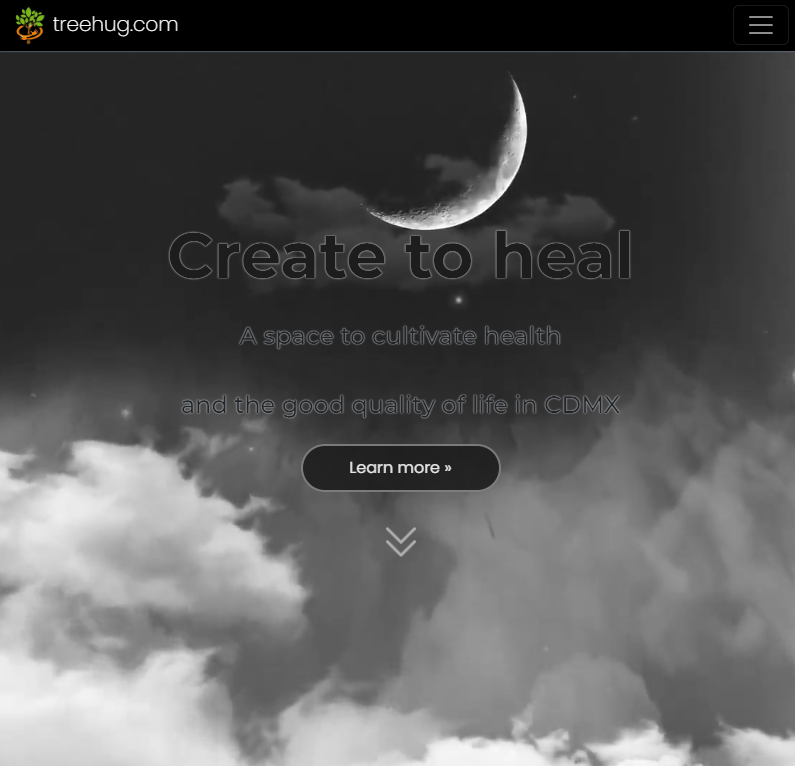

# Landing page template

_This is a template for a landing page_

## Screenshot



## Comenzando 🚀

_Git clone to get a copy of the project_

_Run:_

```bash
git clone https://github.com/santi-iztli/portfolio.git
```

## Prerequisites 📋

_Required programs:_

_Any browser like: Chrome, Firefox, Safari, edge etc..._

_To view this code, the VScode code editor is recommended:_

- [VSCode](https://code.visualstudio.com/) - Download the code editor

## Installation 🔧

_Open project in project folder in VScode_

```
cd location/of/project code .
```

_Happy coding 🚀_

## Iniciar Sass ⌨️

_To make changes to the styles in the project folder execute:_

```
npm run sass
```

or

```
sass --watch src/styles/scss/styles.scss src/styles/css/styles.css
```

## Built with 🛠️

_Technologies used in this project:_

- [HTML](https://developer.mozilla.org/es/docs/Web/HTML) - Hypertext Markup Language
- [Bootstrap](https://getbootstrap.com/docs/5.2/getting-started/introduction/) - Framework CSS
- [Sass](https://sass-lang.com/documentation/) - Style preprocessor
- [JavaScript](https://www.w3schools.com/js/js_es6.asp) - ECMAScript 6 Interpreted Programming Language

## Version 📌

```
1.0
```

## Autor ✒️

- **Santiago Morera** - _Initial Work_ - [Santiago Morera](https://thisisanti.dev)
- **Santiago Morera** - _Documentation_- [Santiago Morera](https://thisisanti.dev)

## Licencia 📄

This project is licensed under the License (Your License) - see the file [LICENSE.md](LICENSE.md) for details by thisisanti.dev

## Expressions of Gratitude 🎁

- Tell others about this project 📢
- Invite a beer 🍺 or a coffee ☕ to someone on the team.
- Give thanks publicly 🤓.

---

⌨️ With ❤️ by [Santiago Morera](https://thisisanti.dev) 😊
